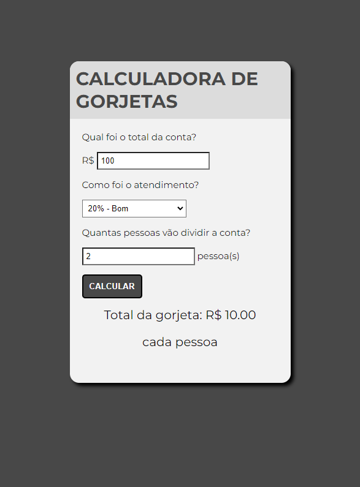

> # OneBitCode - Calculadora de gorjetas

Projeto feito ao longo do minicurso, de HTML, CSS e Javascript, da One Bit Code. Foram abordados tópicos como:

- funções em Javascript;
- inserção de um elemento no HTML através do javascript;
- sombras em CSS;
- seleção de opções em HTML;
- captura pelo javascript de valores inseridos na tela;
- entre outros.

> 🔗 [Veja o projeto aqui](https://marianecr.github.io/start_na_carreira_OCB/)

## 👋🏼 Contatos

- marianectrodrigues@gmail.com
- https://www.linkedin.com/in/marianectrodrigues/
